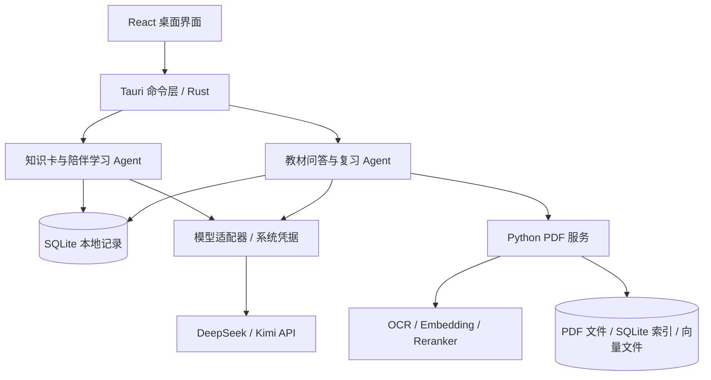

# Tell You Why

一个面向个人用户的 Windows 桌面学习应用：从一张知识卡开始，追问“为什么”，用短时间理解一个概念，再通过自己的 PDF 资料和练习继续学习。

应用包含两条主要使用路径：**知识小窗与陪伴学习**、**PDF 知识库与教材学习**。内置演示卡可以离线浏览；AI 生成、解释和学习助手使用用户配置的在线模型；PDF 识别与检索使用本地模型。

> 本文对应当前 `main` 源码。仓库中的安装启动器仍指向 `v0.1.1`，不代表安装包已经包含后续源码更新。体验下方最新功能，请使用[源码启动](#源码启动)。

## 当前功能

### 知识小窗

- 浏览知识卡、揭晓答案、展开解释，支持收藏、最近浏览、兴趣偏好和本地内容导入。
- 按兴趣生成 AI 知识卡，对卡片继续追问，或选中一段文字后提问。
- 桌面托盘、全局快捷键、置顶、提醒与免打扰设置。
- 默认窗口为 420 × 560，最小 360 × 440；不配置 API Key 也能浏览内置演示内容。

### 陪我学一会儿

- **从主题或原卡开始**：从首页进入后选择主题，或揭晓卡片后点击“围绕这张卡学一会儿”。原卡入口先预览，明确开始后才调用模型。
- **根据反馈调整讲解**：支持“继续 / 没看懂 / 太简单 / 举个例子”，也可以自由提问。回答留在当前步骤，不自动跳到下一段。
- **继续上次**：保存会话与执行检查点，暂停或重启后恢复原进度；回到首页不会自动请求模型。
- **巩固一下**：依据实际提交的练习安排回顾，先补讲，再给一道可跳过的新练习。阅读、收藏和跳过都不计作答成绩。
- **回到原卡**：保留答案和详细解释的展开状态；原卡下可查看相关学习记录。
- **学习收获**：保存实际讲解或回答的原文，回看出处，或移除保存标记。
- **疑问跟进**：回答后选择“明白了 / 还没懂”；未解决问题可以再次解释，或留到之后明确开始新的学习会话。

一次短学习最多 6 个内容步骤、2 道可选练习、4 个问题，并受模型请求、工具调用和执行时间预算限制。“明白了”是用户反馈，练习结果是与 AI 参考答案的比较，两者都不代表已经客观测量长期掌握程度。

详细操作、数据边界及真实模型验收记录见 [陪伴学习指南](docs/study-companion.md)。

### PDF 知识库

- 导入 PDF，提取文字；扫描页面使用 OCR，并结合版面分析整理内容。
- 浏览章节、原文与 PDF 页面，使用关键词和向量混合检索查找资料。
- “相关原文”使用本地 Reranker 重排，最多展示 5 条结果。
- 教材问答与学习卡先检索、预览摘录，再明确发送给在线模型；回答支持引用定位。
- 支持教材随机学习、复习 Agent、实际作答记录和到期复习；复习执行具有预算、暂停、恢复及执行追踪。

PDF 知识库与普通知识卡的陪伴学习分别保存记录。使用陪伴学习无需先安装 PDF 环境。

操作说明：[PDF 导入](docs/pdf-desktop-guide.md) · [教材问答](docs/rag-minimal-loop-guide.md) · [随机学习](docs/random-learning-guide.md) · [复习 Agent](docs/review-agent-guide.md)。

### 模型设置与开发者工具

- “模型设置”区分在线生成模型和 PDF 本地模型，展示本地模型用途及对应版本的 Hugging Face 下载页。
- **⋯ → 开发者工具 → 质量评测**提供 Agent 流程、RAG Top 5 和真实模型评测，以及人工题库编辑、封存、分组、输出复核和 JSON 导出。日常学习不需要使用该面板。
- 评测区分执行结果、检索指标和人工内容判断；未复核样本不会自动算作正确。

## 最近更新

当前源码已在早期知识小窗和 PDF 功能基础上加入：

1. **人工评测基准**：按 PDF 版本维护参考答案与证据，封存题库，区分开发、回归、留出分组，记录实际使用与复核覆盖率。
2. **陪伴学习 Agent**：读取本地卡片和允许使用的学习记录，按反馈讲解、出题和回答问题；保存检查点并限制执行预算。
3. **继续上次与巩固一下**：恢复原会话，根据真实练习记录安排复习，不把浏览行为当作掌握成绩。
4. **卡片学习与自由提问**：围绕原卡开始，保存来源快照，追问时保持当前学习步骤。
5. **原卡衔接、学习收获与疑问跟进**：返回原卡、保存讲解原文、查看相关历史，并持续跟进用户明确反馈未解决的问题。

以上是源码更新，尚未在本次更新中重新打包发布 Windows 安装包。验证范围与待完成项见[当前边界](#当前边界)。

## 源码启动

### 1. 准备开发环境

- Windows 10 1903+ 或 Windows 11，x64。
- Node.js 22.12+，npm 10+。
- Rust stable，MSVC 工具链。
- Visual Studio 2022 Build Tools，勾选“使用 C++ 的桌面开发”，包含 Windows SDK。
- WebView2 Runtime。

**仅运行知识小窗和陪伴学习，不需要 Python、OCR 或向量模型。** PDF 功能按后面的独立步骤准备。

### 2. 安装依赖并启动桌面窗口

在项目根目录打开 PowerShell：

```powershell
npm.cmd ci
npm.cmd run tauri -- dev
```

首次启动会下载、编译 Rust 依赖，耗时与磁盘占用会明显高于之后的启动。看到桌面窗口后即可浏览卡片。

也可以使用源码启动脚本；缺少 `node_modules` 时会先安装 npm 依赖：

```powershell
powershell.exe -NoProfile -ExecutionPolicy Bypass -File .\scripts\start-source.ps1
```

PowerShell 中使用 `npm.cmd` 可以避免 `npm.ps1` 被执行策略阻止。仅执行 `npm ci` 是安装依赖，不会启动应用。

### 3. 配置在线模型

打开 **模型设置 → 在线生成模型**，选择供应商、区域和模型，保存 API Key，然后点击“测试连接”。通过后即可使用 AI 生成、追问和学习助手。

以下是当前源码内置的模型 ID；是否可调用还取决于供应商接口及账号权限：

| 供应商      | 模型 ID                                | 接口域名           |
| ----------- | -------------------------------------- | ------------------ |
| DeepSeek    | `deepseek-v4-flash`、`deepseek-v4-pro` | `api.deepseek.com` |
| Kimi 中国区 | `kimi-k3`、`kimi-k2.6`                 | `api.moonshot.cn`  |
| Kimi 全球区 | `kimi-k3`、`kimi-k2.6`                 | `api.moonshot.ai`  |

供应商、模型和地址由 [Provider Registry](src-tauri/src/providers/mod.rs) 管理，界面不接受任意 Base URL。陪伴学习会话固定使用开始时的模型配置；变更配置后需恢复原配置或结束后重新开始。

### 仅预览前端

```powershell
npm.cmd run dev
```

浏览器打开 `http://127.0.0.1:1420`。此模式使用演示数据，不能验证真实 SQLite、系统凭据、PDF、Agent 执行、托盘或快捷键；完整功能请使用桌面模式。

## 使用已发布安装包

不修改代码的用户可以到 [GitHub Releases](https://github.com/Hccccy2002/Tell-You-Why/releases) 下载对应版本的 Windows 完整安装包。仓库当前的 [发布清单](packaging/release.json) 指向 `v0.1.1`，文件名为 `Tell-You-Why_0.1.1_windows-x64-full-setup.exe`。

该完整包约 1.75 GB，包含 Python、PDF/OCR 依赖、五组本地模型及 WebView2 安装组件，无需先安装 Node.js、Rust 或 Python。个人 PDF 仍需自行导入。

`start.cmd` 和 `启动 Tell You Why.cmd` 会下载、校验并启动发布清单中的安装版，**不会编译当前源码**。如果仓库访问需要鉴权，启动器可使用已登录的 Git 凭据或 GitHub CLI；也可在有权限的浏览器中手动下载安装包。详细分发与安装说明见 [Windows 分发记录](docs/windows-distribution.md)。

## PDF 开发环境（可选）

完整安装包用户通常无需执行本节。源码开发使用 Python `>=3.11,<3.13`，以下以 Python 3.12 x64 为例；建议使用不含中文的开发路径，避免部分原生 OCR 依赖的路径兼容问题。

### 1. 创建环境并安装锁定依赖

在项目根目录逐条执行，确认上一条成功后继续：

```powershell
py -3.12 -m venv .\rag-service\.venv
.\rag-service\.venv\Scripts\python.exe -m pip install -r .\rag-service\requirements.lock.txt
.\rag-service\.venv\Scripts\python.exe -m pip install --no-deps --no-build-isolation -e .\rag-service
.\rag-service\.venv\Scripts\python.exe -m pip check
```

如果使用 Conda 而没有 `py`，可用以下两条替代创建 venv 的第一条命令，然后继续安装依赖：

```powershell
conda create -n tellwhy-pdf-python python=3.12 -y
conda run -n tellwhy-pdf-python python -m venv .\rag-service\.venv
```

请保留创建 venv 时使用的基础 Python，虚拟环境不能直接复制到另一台电脑。

### 2. 准备并校验固定模型

```powershell
.\rag-service\.venv\Scripts\python.exe -m tellwhy_kb models prepare --data-root .\data
.\rag-service\.venv\Scripts\python.exe -m tellwhy_kb models verify --data-root .\data
.\rag-service\.venv\Scripts\python.exe -m tellwhy_kb.indexing.reranker prepare --models-root .\data\models
.\rag-service\.venv\Scripts\python.exe -m tellwhy_kb.indexing.reranker verify --models-root .\data\models
```

首次下载需要联网及足够磁盘空间。模型文件按固定 revision 下载，并使用文件哈希校验。下载与校验完成后，PDF 处理和检索在本机运行；AI 解释、生成及复习仍需在线模型。

| 用途         | 当前模型及对应版本下载页                                                                                                     |
| ------------ | ---------------------------------------------------------------------------------------------------------------------------- |
| OCR 文字检测 | [PP-OCRv5_server_det](https://huggingface.co/PaddlePaddle/PP-OCRv5_server_det/tree/ca867c897ecbca8873081573a802ad70d499cb94) |
| OCR 文字识别 | [PP-OCRv5_server_rec](https://huggingface.co/PaddlePaddle/PP-OCRv5_server_rec/tree/b26c3587fda8da3c8ec0ce357214b4d661ff1558) |
| 版面分析     | [PP-DocLayout-S](https://huggingface.co/PaddlePaddle/PP-DocLayout-S/tree/8ac289e66575bb9bba6e15c53719d8b15cc9b3b2)           |
| Embedding    | [BAAI/bge-small-zh-v1.5](https://huggingface.co/BAAI/bge-small-zh-v1.5/tree/7999e1d3359715c523056ef9478215996d62a620)        |
| Reranker     | [BAAI/bge-reranker-base](https://huggingface.co/BAAI/bge-reranker-base/tree/2cfc18c9415c912f9d8155881c133215df768a70)        |

这些链接也可从 APP 的“模型设置 → PDF 知识库模型”打开。当前提供固定模型的说明与下载入口，**尚不支持在界面中导入或替换任意 OCR、Embedding、Reranker 模型**。

### 3. 导入自己的 PDF

重新启动桌面应用，在“PDF 知识库”选择 PDF 并开始导入，首次建议用少量页面验证环境。仓库不附带已导入的个人知识库；把 PDF 放到项目根目录不会自动导入。

开发模式默认使用 `rag-service/.venv` 和项目 `data/`。需要自定义路径时，在启动应用的同一 PowerShell 窗口设置：

```powershell
$env:TELLWHY_RAG_SERVICE = (Resolve-Path .\rag-service).Path
$env:TELLWHY_PYTHON = (Resolve-Path .\rag-service\.venv\Scripts\python.exe).Path
$env:TELLWHY_KB_DATA = Join-Path (Get-Location).Path 'data'
$env:TELLWHY_KB_MODELS = Join-Path $env:TELLWHY_KB_DATA 'models'
npm.cmd run tauri -- dev
```

旧的环境变量可能使应用指向失效目录。Python 或依赖缺失时检查上述 venv；模型缺失时重新执行 `prepare / verify`。更多命令见 [Python PDF 模块](rag-service/README.md)。

## 架构与源码入口



技术栈：Tauri 2、React 19、TypeScript 5.9、Vite 7、Rust、SQLite，以及 Python、PaddleOCR、Sentence Transformers。PDF 检索结合 SQLite FTS5/BM25 和本地向量，不依赖单独部署的数据库服务器。在线模型请求由 Rust 发起，Python 不持有 API Key。

| 目录 / 文件                                         | 职责                                             |
| --------------------------------------------------- | ------------------------------------------------ |
| `src/App.tsx`、`src/screens/`、`src/components/`    | 页面导航、知识卡、学习界面与组件测试             |
| `src/lib/`                                          | 前端数据类型、Tauri 调用与界面状态辅助           |
| `src-tauri/src/lib.rs`、`commands.rs`               | 桌面初始化、命令注册与通用应用操作               |
| `src-tauri/src/study*.rs`                           | 陪伴学习状态、工具执行、保存恢复、练习与疑问跟进 |
| `src-tauri/src/rag*.rs`、`review*.rs`、`harness/`   | 教材问答、复习 Agent 与执行预算、取消、追踪      |
| `src-tauri/src/db.rs`、`providers/`                 | 数据库迁移与在线模型适配                         |
| `src-tauri/src/evaluation*.rs`、`evals/`            | 开发者评测、人工题库与评分                       |
| `rag-service/src/tellwhy_kb/`、`rag-service/tests/` | PDF 处理、本地检索和 Python 测试                 |
| `src-tauri/resources/`、`examples/`                 | 内置演示卡与 JSON/CSV 导入模板                   |
| `scripts/`、`packaging/`                            | 源码启动、固定发布启动器与 Windows 完整打包      |
| `docs/`                                             | 使用指南、设计记录与分阶段验收                   |

学习 Agent 的关键约束由程序执行：用户提交先持久化，模型工具参数需校验，关键写入与检查点一同保存，迟到响应不能覆盖已暂停或结束的状态。普通卡片搜索使用 SQLite 关键词；PDF 检索才使用本地向量模型。

## 数据与隐私

| 数据                                           | 默认位置                                                  |
| ---------------------------------------------- | --------------------------------------------------------- |
| 知识卡、设置、问答、学习会话、练习、收获与疑问 | `%APPDATA%\com.tellyouwhy.desktop\tell-you-why.db`        |
| API Key                                        | Windows Credential Manager；SQLite 仅保存引用及末四位掩码 |
| 源码开发的 PDF 与模型                          | `data/knowledge-bases/`、`data/models/`                   |
| 完整安装版的 PDF 数据                          | `%LOCALAPPDATA%\com.tellyouwhy.desktop\pdf-data\`         |
| 完整安装版的模型与 Python                      | 安装目录下 `pdf-runtime/`                                 |
| 评测任务、人工题库与复核                       | 应用数据目录下 `evaluations/`                             |

浏览已有内容、恢复已保存进度、保存学习收获不调用在线模型。主动生成、提问、继续讲解和开始巩固等操作会发送所需主题、卡片、对话或允许使用的学习记录；PDF 问答发送已预览的摘录。首次模型下载也需要联网。

关闭个性化后，不展示历史驱动的巩固与疑问建议，也不能继续发送这些历史任务的上下文；当前主动学习仍可使用必要的会话内容。陪伴学习页面的“清除陪伴学习记录”会清除会话、练习安排、收获和疑问，保留知识卡、收藏与模型配置。通用设置中的“清除阅读记录”不等于清除学习会话或卡片追问。

本地保存的原卡快照、问答与收获可能在原卡删除后继续作为学习历史存在，需要通过相应学习记录清除入口删除。请勿把真实 API Key、个人数据库或个人 PDF 提交到仓库。

## 测试与开发验证

```powershell
npm.cmd run lint
npm.cmd test
npm.cmd run build

cargo fmt --manifest-path src-tauri/Cargo.toml --all -- --check
cargo test --manifest-path src-tauri/Cargo.toml --lib
cargo clippy --manifest-path src-tauri/Cargo.toml --all-targets --all-features -- -D warnings
```

配置 PDF 开发环境后，可运行 Python 回归。为 pytest 使用独立临时目录，避免旧目录权限冲突：

```powershell
New-Item -ItemType Directory -Force -Path .\tmp | Out-Null
$pdfTestTemp = Join-Path (Get-Location).Path ('tmp\pytest-pdf-' + [Guid]::NewGuid().ToString('N'))
.\rag-service\.venv\Scripts\python.exe -m pytest .\rag-service\tests -q --basetemp $pdfTestTemp
.\rag-service\.venv\Scripts\python.exe -m unittest discover -s evals/textbook
.\rag-service\.venv\Scripts\python.exe -m unittest discover -s evals -p test_panel.py
```

前端测试使用 Vitest / Testing Library；Rust 测试覆盖状态迁移、检查点、取消、幂等、预算和数据库；Python 测试覆盖文档处理、检索与评测。部分真实环境、模型或桌面验收入口默认忽略，须按各指南显式运行。

自动化受控响应验证执行逻辑，不构成真实模型回答质量或用户学习效果的证据。人工基准及输出复核见 [人工评测指南](docs/human-evaluation.md)，面板与执行限制见 [质量评测面板](docs/evaluation-panel.md)。

## 构建 Windows 完整安装包

```powershell
powershell.exe -NoProfile -ExecutionPolicy Bypass -File .\scripts\build-windows.ps1
```

脚本准备 Python、锁定依赖、模型、运行库、WebView2 和许可文件，编译当前源码，并使用 Inno Setup 7 x64 生成完整安装包。首次构建需要下载较多资源。

产物写入 `release-artifacts/`；版本、安装包大小和 SHA-256 记录于 `packaging/release.json`。重新发布时应让版本、安装包与发布清单保持一致。单独运行 `npm.cmd run tauri -- build` 不包含完整 PDF 运行资源。

`node_modules/`、`src-tauri/target/`、`rag-service/.venv/`、`data/models/`、`data/knowledge-bases/`、`src-tauri/pdf-runtime/` 和安装产物不随 Git 源码上传。它们是项目磁盘占用的主要来源；构建目录可重新生成，删除 Python 或模型后则需要重新准备才能使用 PDF，个人知识库应先备份。

## 当前边界

- 内置卡是演示内容；AI 输出与 OCR 结果仍需要核对，引用可定位不等于事实已经人工确认。
- 普通知识卡生成采用题面相似度去重，未实现语义去重；陪伴学习虽有复习知识点标识，也没有跨自由学习会话的语义合并。
- 本地模型目前固定，尚未实现用户自定义模型导入、多设备同步或客观的学习效果测量。
- 已有陪伴学习、恢复、巩固、原卡提问等桌面真实模型记录；**疑问跨会话跟进的最终修复已通过自动化测试，修复后的桌面真实模型全流程复测仍待完成**。详见 [分阶段验收](docs/study-companion.md#2026-09-16-原卡衔接学习收获与疑问跟进验收)。
- Windows 完整安装包的代码签名及更多干净系统、升级场景仍需完善；前端生产构建目前存在主脚本超过 500 kB 的体积提示。

## 更多文档

- [陪伴学习与验收](docs/study-companion.md)
- [人工评测基准](docs/human-evaluation.md)
- [PDF 桌面指南](docs/pdf-desktop-guide.md)
- [相关原文 Top 5](docs/related-sources-top5.md)
- [复习 Agent](docs/review-agent-guide.md) / [执行控制与取消](docs/harness-v2-guide.md)
- [内容导入与审核](docs/content-import.md)：支持最大 5 MB 的 [JSON](examples/cards-import-template.json) / [CSV](examples/cards-import-template.csv)
- [Windows 分发](docs/windows-distribution.md)
- [技术决策](docs/decisions.md) / [人工测试清单](docs/manual-test-checklist.md)

早期 MVP 设计与实施计划保留为历史资料。判断当前已实现功能时，请以当前源码、使用指南和对应验收记录为准。
