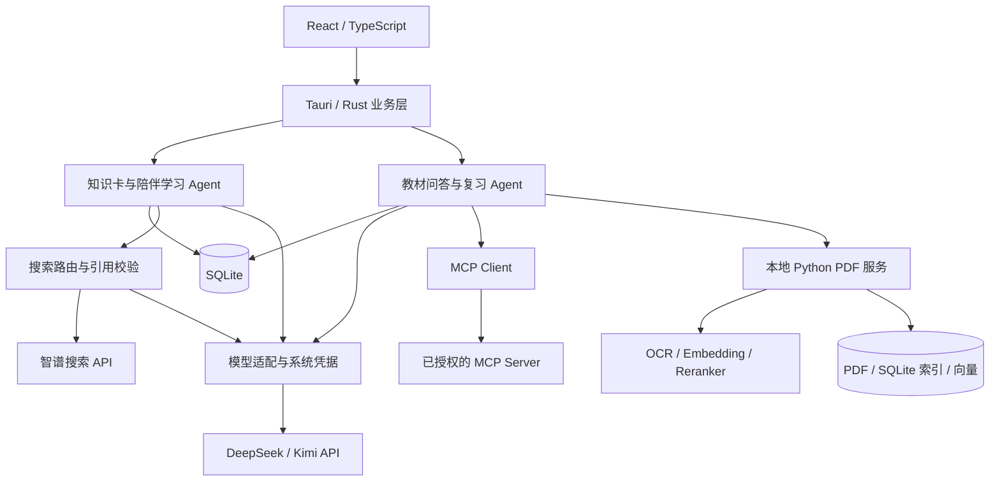

# Tell You Why

一个面向个人学习的 Windows 桌面应用：从知识卡发现问题，通过 AI 追问理解概念，再用自己的 PDF 资料完成检索、学习和复习。

**Tauri 2 · React 19 · TypeScript · Rust · Python · SQLite · RAG · MCP**

项目包含三个学习入口：知识小窗、学习中心和 PDF 知识库。DeepSeek / Kimi 负责生成与解释，智谱提供按需联网搜索，本地模型负责 PDF 提取、OCR、向量检索和重排。未配置 API Key 时仍可离线浏览内置演示卡。

本文对应 `main` 分支，更新于 2026-10-09。[源码启动](#源码启动)可体验当前功能；[已发布的 v0.1.1 安装包](#使用已发布安装包)对应较早版本。

## 功能概览

| 模块       | 已实现能力                                                                            |
| ---------- | ------------------------------------------------------------------------------------- |
| 知识小窗   | 知识卡、答案与解释、收藏和历史、兴趣推荐、追问与划词解释、托盘和快捷键                |
| 学习中心   | 按主题或目标学习、反馈后补讲、可选练习、暂停与恢复、学习收获、疑问跟进                |
| PDF 知识库 | PDF 导入与 OCR、章节整理、原文页查看、关键词与向量混合检索、Top 5 重排                |
| 教材学习   | 基于摘录的问答与知识卡、随机学习、复习 Agent、实际作答记录与到期复习                  |
| 联网搜索   | 智谱搜索路由、单次联网核查、引用校验、来源保存、短期缓存与调用预算                    |
| MCP Client | stdio / Streamable HTTP、Tools / Resources / Prompts 发现、会话工具授权与 Schema 快照 |
| 开发者评测 | Agent 流程回归、RAG 检索评测、真实模型评测、人工题库与输出复核                        |

常用入口位于顶部的“学习”“PDF”和主菜单。AI 配置位于 **菜单 → 更多设置 → AI 模型**；MCP 和质量评测位于 **菜单 → 开发者工具**。

## 工程实现

### 可恢复的学习 Agent

学习与复习流程保存会话、工具调用及执行检查点，支持暂停、恢复和重启后继续。模型请求、工具调用及执行时间有预算；用户提交先持久化，关键写入与检查点一起保存，重复提交和迟到响应受执行状态校验约束。

代码入口：[陪伴学习](src-tauri/src/study.rs) · [复习 Agent](src-tauri/src/review_agent.rs) · [执行控制](src-tauri/src/harness/) · [数据操作互斥](src-tauri/src/persistence_gate.rs)。

### 可追溯的本地 RAG

PDF 经提取 / OCR、章节整理、分块及索引后发布为版本化知识库。检索结合 SQLite FTS5/BM25 和 BGE 向量，以加权 RRF 融合；相关原文再使用交叉编码器重排。证据保留教材版本、片段身份、物理页码与位置，用户可以回到原文核对。

代码入口：[Python 知识库](rag-service/src/tellwhy_kb/) · [RAG 命令](src-tauri/src/rag_commands.rs) · [Top 5 原文检索](docs/related-sources-top5.md)。

### 搜索与外部工具边界

联网回答保存来源快照，引用校验失败时在预算内修正；搜索无结果、凭据失败和接口故障分别处理。MCP 工具在复习会话开始时显式授权，并固定工具与 Schema 快照，后续配置变化不会静默扩大旧会话权限。

代码入口：[搜索模块](src-tauri/src/search/) · [MCP Client](src-tauri/src/mcp.rs) · [MCP 使用与边界](docs/mcp-client-guide.md)。

### 桌面数据与测试

React 通过 Tauri 命令访问 Rust 业务层；Rust 管理 SQLite、在线模型和系统凭据，并通过进程协议调用本地 Python。API Key 和远程 MCP Token 保存在 Windows Credential Manager，SQLite 保存引用与尾号。前端、Rust、Python 和评测脚本各有回归测试。

代码入口：[数据库](src-tauri/src/db.rs) · [模型适配](src-tauri/src/providers/) · [系统凭据](src-tauri/src/secret_store.rs) · [评测代码](evals/)。

## 架构



| 目录                     | 职责                                                   |
| ------------------------ | ------------------------------------------------------ |
| `src/`                   | 页面、组件、界面状态、Tauri 调用与前端测试             |
| `src-tauri/src/`         | 桌面能力、业务数据、学习 Agent、搜索、MCP 与 Rust 测试 |
| `rag-service/`           | PDF 处理、本地模型、检索、版本化发布与 Python 测试     |
| `evals/`                 | 固定评测场景、检索基准、评分脚本与示例报告             |
| `scripts/`、`packaging/` | 源码启动、运行资源准备、Windows 安装包与校验清单       |
| `docs/`                  | 使用指南、技术决策、验证说明及历史设计                 |
| `examples/`              | 知识卡 JSON / CSV 导入模板                             |

## 源码启动

### 开发环境

- Windows 10 1903+ / Windows 11，x64。
- Node.js 22.12+、npm 10+。
- Rust stable，MSVC 工具链。
- Visual Studio 2022 Build Tools：C++ 桌面开发及 Windows SDK。
- WebView2 Runtime。

仅运行知识小窗和陪伴学习无需 Python 或本地模型。

```powershell
 git clone --branch main https://github.com/Hccccy2002/Tell-You-Why.git
 cd Tell-You-Why
 npm.cmd ci
 npm.cmd run tauri -- dev
```

也可运行 `scripts/start-source.ps1`；首次缺少 npm 依赖时会自动安装。首次 Rust 编译需要下载依赖并占用较多时间与磁盘。

### 前端演示

```powershell
npm.cmd ci
npm.cmd run dev
```

打开 `http://127.0.0.1:1420` 可查看使用演示数据的前端。SQLite、系统凭据、PDF、真实 Agent 和桌面能力需要在 Tauri 应用中验证。

### 在线模型与搜索

在 **菜单 → 更多设置 → AI 模型** 中配置 DeepSeek / Kimi，保存 API Key 并测试连接。可调用模型由[供应商注册表](src-tauri/src/providers/mod.rs)及账号权限决定。

智谱使用独立 Key；测试连接后选择“关闭 / 自动判断 / 每次联网”，也可只对当前问题勾选“本次联网核查”。生成模型与搜索服务需要使用者自行提供账号，连接测试和主动调用可能产生费用。配置步骤见[联网搜索指南](docs/search-agent-guide.md)。

## PDF 知识库运行环境

PDF 功能使用 Python `>=3.11,<3.13`，推荐 Python 3.12 x64。在项目根目录执行：

```powershell
py -3.12 -m venv .\rag-service\.venv
.\rag-service\.venv\Scripts\python.exe -m pip install -r .\rag-service\requirements.lock.txt
.\rag-service\.venv\Scripts\python.exe -m pip install --no-deps --no-build-isolation -e .\rag-service
.\rag-service\.venv\Scripts\python.exe -m pip check

.\rag-service\.venv\Scripts\python.exe -m tellwhy_kb models prepare --data-root .\data
.\rag-service\.venv\Scripts\python.exe -m tellwhy_kb models verify --data-root .\data
.\rag-service\.venv\Scripts\python.exe -m tellwhy_kb.indexing.reranker prepare --models-root .\data\models
.\rag-service\.venv\Scripts\python.exe -m tellwhy_kb.indexing.reranker verify --models-root .\data\models
```

没有 `py` 时，可用 Conda 创建 Python 3.12 环境，再以该环境的 Python 创建上述 venv。模型首次下载需要联网；之后 PDF 处理与检索在本机执行，AI 问答只在用户确认后发送必要摘录。

| 用途            | 固定模型                                  |
| --------------- | ----------------------------------------- |
| OCR 检测 / 识别 | PP-OCRv5_server_det / PP-OCRv5_server_rec |
| 版面分析        | PP-DocLayout-S                            |
| Embedding       | BAAI/bge-small-zh-v1.5                    |
| Reranker        | BAAI/bge-reranker-base                    |

模型 revision、哈希校验与 CLI 操作见 [Python 模块说明](rag-service/README.md)。准备完成后，重启应用并在“PDF 知识库”选择自己的 PDF 导入。仓库不附带教材、模型权重或已导入知识库。

## 测试与评测

```powershell
npm.cmd run lint
npm.cmd test
npm.cmd run build

cargo fmt --manifest-path src-tauri/Cargo.toml --all -- --check
cargo test --manifest-path src-tauri/Cargo.toml --lib
cargo clippy --manifest-path src-tauri/Cargo.toml --all-targets --all-features -- -D warnings

node --test evals/search-agent/contract.test.mjs
```

配置 Python 环境后，运行 PDF 与评测回归：

```powershell
New-Item -ItemType Directory -Force -Path .\tmp | Out-Null
$pdfTestTemp = Join-Path (Get-Location).Path ('tmp\pytest-pdf-' + [Guid]::NewGuid().ToString('N'))
.\rag-service\.venv\Scripts\python.exe -m pytest .\rag-service\tests -q --basetemp $pdfTestTemp
.\rag-service\.venv\Scripts\python.exe -m unittest discover -s evals/textbook
.\rag-service\.venv\Scripts\python.exe -m unittest discover -s evals -p test_panel.py
```

自动化测试覆盖流程、持久化、暂停恢复、重复提交、预算和故障处理。真实模型与部分环境测试默认跳过，须按文档显式运行。模拟流程通过率不代表模型准确率，历史教材评测也不代表跨教材泛化能力；原 PDF 与匹配索引需自行准备。

评测说明：[复习 Agent](evals/review-agent/README.md) · [教材检索](evals/textbook/README.md) · [人工复核](docs/human-evaluation.md) · [质量评测面板](docs/evaluation-panel.md)。

## 数据与隐私

| 内容                         | 默认位置                                           |
| ---------------------------- | -------------------------------------------------- |
| 知识卡、设置、问答与学习记录 | `%APPDATA%\com.tellyouwhy.desktop\tell-you-why.db` |
| API Key、MCP Token           | Windows Credential Manager                         |
| 源码开发的 PDF 知识库与模型  | `data/knowledge-bases/`、`data/models/`            |
| 安装版的 PDF 数据            | `%LOCALAPPDATA%\com.tellyouwhy.desktop\pdf-data\`  |

本地 PDF 处理与检索无需在线模型。主动生成、追问或复习会发送该任务所需上下文；联网搜索向智谱发送搜索词，搜索摘要交给生成模型。已授权 MCP 工具的参数会发送给相应 Server，结果可能返回模型，详见 [MCP 数据边界](docs/mcp-client-guide.md#数据边界)。

学习资料、旧语料包、机器运行附件、模型、个人数据库和构建产物不随当前源码提交。内置演示卡及固定评测样例用于开发验证。

## 使用已发布安装包

[GitHub Releases](https://github.com/Hccccy2002/Tell-You-Why/releases) 提供 Windows 完整安装包。[发布清单](packaging/release.json)目前指向 `v0.1.1`，约 1.75 GB，包含 Python、PDF/OCR 依赖、本地模型与 WebView2 组件。

根目录 `start.cmd` / `启动 Tell You Why.cmd` 下载、校验并启动该发布版本。安装包不包含 main 的全部后续功能，体验当前实现请从源码启动。完整打包命令：

```powershell
powershell.exe -NoProfile -ExecutionPolicy Bypass -File .\scripts\build-windows.ps1
```

构建产物写入 `release-artifacts/`。运行资源与历史分发验证见 [Windows 分发说明](docs/windows-distribution.md)。

## 已知限制

- 内置知识卡是演示内容；AI 输出、OCR 和引用支持程度仍需核对。
- 搜索目前覆盖知识卡追问、划词解释及学习中心问答；自动生成卡片、学习讲解、目标规划和 PDF 问答尚未接入智谱搜索。
- MCP 自动工具调用目前限于 PDF 复习 Agent；Resources / Prompts 已支持发现，尚未自动注入学习流程，远程授权暂不支持 OAuth。
- 本地模型固定，尚不支持界面导入任意模型、多设备同步或客观测量长期学习效果。
- 桌面交互、干净 Windows 环境、升级和签名验证仍有待完善；历史验收范围见对应指南。

## 文档导航

- [陪伴学习](docs/study-companion.md) · [联网搜索](docs/search-agent-guide.md)
- [PDF 导入](docs/pdf-desktop-guide.md) · [教材问答](docs/rag-minimal-loop-guide.md) · [随机学习](docs/random-learning-guide.md)
- [复习 Agent](docs/review-agent-guide.md) · [执行控制](docs/harness-v2-guide.md) · [MCP Client](docs/mcp-client-guide.md)
- [知识卡导入](docs/content-import.md) · [技术决策](docs/decisions.md) · [人工测试清单](docs/manual-test-checklist.md)

`docs/` 内标注日期的计划与验收记录用于回看历史实现，当前能力以 main 源码及使用指南为准。
