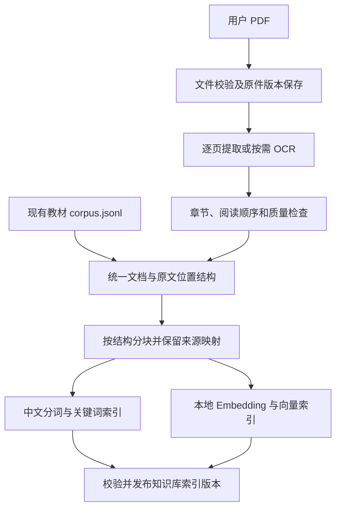
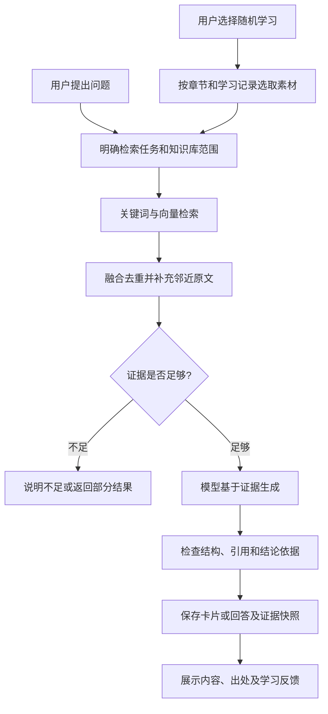

# Tell You Why：PDF、知识库、RAG 与随机学习完整开发路线

日期：2026-09-10。状态：**PDF 资料准备与界面已完成；RAG 最小闭环已通过阶段验收**。已验证 DeepSeek 真实问答与单张卡、引用原页、APP 保存及重启读取。当前实现和使用方式见[教材问答与单张学习卡](rag-minimal-loop-guide.md)，最终验收结果见[阶段记录](rag-minimal-loop-acceptance.md)。下文保留整体路线，实际顺序按用户要求先完成 PDF 模块；阶段 5 的随机学习、近期避重和基础学习状态已实现，本地测试通过；真实模型抽查待发送授权，详见 [随机学习验收记录](random-learning-acceptance.md)。

本文件统一开发顺序、模块依赖和交付标准。此前的 [PDF 知识库方案](pdf-knowledge-base-plan.md) 与 [计算机硬件 RAG 方案](rag-implementation-plan.md) 保留为专题设计；涉及执行顺序和桌面连接方式时，以本文件为准。

当前优先范围按用户最新要求收敛为：以《计算机组成原理.pdf》先完成 Python 资料准备模块。案例检查、目录、模型与执行步骤见 [Python 资料准备方案](pdf-data-preparation-python-plan.md)。后续再接回本路线的生成和学习阶段。

上一份 PDF 方案中的分块、检索、证据组织和生成已经包含 RAG。完整开发应从一开始使用统一的文档、片段、索引和引用结构，PDF/OCR 与现有教材文本作为不同输入接入。

## 1. 最终交付范围

用户能够创建知识库、导入普通中英文印刷 PDF 教材、查看识别情况、选择章节生成知识卡、查看教材出处，并围绕卡片或整本教材进行有依据的问答。已生成卡片和学习记录本地持久保存。

第一版包含可恢复导入、逐页按需 OCR、关键词与向量混合检索、引用检查、章节均衡随机学习和基础学习状态。复杂公式/图表理解、间隔复习、跨书综合推理、重排序模型和 Agent 自主多轮检索作为后续评测驱动的增强项。

导入及检索默认本地执行。模型资源准备好后，无网络也能导入、检索、阅读原文和已存卡片。新卡生成和 AI 追问复用现有云端通道，单独显示资料发送范围和用量。

## 2. 两条运行流程

### 2.1 资料准备：导入或更新资料时执行

导入是可恢复的持久化任务；发布后的索引为后续多次生成和问答复用。资料、提取规则或模型配置发生变化时，按版本重建受影响部分。

### 2.2 学习与问答：用户请求新内容时执行

RAG 在每次生成时检索相关原文，再将证据加入模型上下文；Embedding 用于表示文本以便搜索。教材导入不需要训练或微调现有生成模型。[Anthropic 的 RAG 与混合检索说明](https://www.anthropic.com/engineering/contextual-retrieval)

随机浏览已存卡片直接读取本地数据；只有生成新卡片或发起 AI 问答才进入上述生成流程。

## 3. 模块职责与接口先行

| 模块                 | 责任                                                 | 主要输出                       |
| -------------------- | ---------------------------------------------------- | ------------------------------ |
| React/Tauri 界面     | 知识库管理、进度、章节选择、卡片和原文对照           | 用户任务与学习反馈             |
| Rust 核心            | 调度、范围校验、业务数据库、模型请求、预算及结果提交 | 导入任务、生成任务、持久化结果 |
| Python 工作进程      | PDF/OCR、结构化、分块、索引、检索及证据读取          | 文档产物、检索候选和证据包     |
| 本地文件与知识库数据 | PDF 原件、正文、位置映射和版本化索引                 | 可追溯原文与索引快照           |
| 业务 SQLite          | 知识库登记、卡片、引用快照、任务摘要和用户状态       | 可恢复的应用状态               |
| 现有模型适配器       | 基于给定证据生成或回答                               | 带证据 ID 的结构化草稿         |

Python 模块先提供 CLI，再打包为 Rust 管理的 sidecar，桌面采用结构化进程管道通信。统一替代旧 RAG 专题方案中的 FastAPI 桌面接入建议。工作进程不持有云端 API Key，也不直接写用户收藏和追问等业务表。

在业务实现前确定以下协议；名称可随实现调整，但身份、版本和范围语义需要固定：

| 对象             | 必需信息                                                              |
| ---------------- | --------------------------------------------------------------------- |
| Document         | 知识库 ID、文档 ID、来源类型、版本、内容哈希、标题、导入范围          |
| SourceBlock      | 原始文本、规范化文本、章节、质量状态、位置及转换映射                  |
| SourceLocation   | PDF 页码/书内页码/位置框，或既有文本来源的行号/字符范围               |
| Chunk            | 文档版本、分块规则版本、chunk ID、正文、章节路径、来源块映射          |
| IndexManifest    | 索引 ID、资料版本集合、分块/分词/Embedding 配置、产物校验值和就绪状态 |
| RetrievalRequest | 知识库与文档版本、章节范围、查询、检索模式和候选数量                  |
| Evidence         | 程序分配的证据 ID、真实原文、位置、版本、内容限制                     |
| GenerationTask   | 类型、请求数量、难度、资料范围、证据包、次数/Token/时间预算           |
| GroundedResult   | 完成/部分完成/依据不足、内容、引用 ID、实际模型、用量与失败原因       |

资料类型只影响导入和原文定位；分块之后共享检索、生成、存储和评测能力。来源信息由程序维护，模型不生成文件路径、页码或来源 URL。

## 4. 实际开发顺序与阶段交付

| 阶段                      | 开发内容                                                                                   | 进入下一阶段前的验收                                                      | 粗估开发日 |
| ------------------------- | ------------------------------------------------------------------------------------------ | ------------------------------------------------------------------------- | ---------- |
| 0：范围与协议、可行性验证 | 固定第一版教材范围、数据协议、样例与评测任务；冒烟验证 OCR CPU 推理和 Windows 工作进程打包 | 接口草案可评审，PDF 定位/OCR/部署无未知的根本阻碍，记录未解决限制         | 1–2        |
| 1：统一知识库基础         | 知识库及版本登记、迁移、文件目录、原文位置、分块、导入任务骨架；接入已有 corpus            | 正文可按 ID 读取，片段可回到原文，重复导入幂等，旧卡片可正常读取          | 2–3        |
| 2：检索引擎               | 中文分词 BM25 基线、本地 Embedding、向量搜索、排名融合、范围过滤及调试 CLI                 | 固定检索样例能找到足够原文，知识库和章节隔离有效，输出检索评测报告        | 2–3        |
| 3：RAG 最短完整流程       | 基于证据的问答与单张卡生成、结构和引用校验、保存证据快照、最小展示入口                     | 从现有教材生成一张有引用卡片；重启后可读出处；资料不足可正确退出          | 2–3        |
| 4：用户 PDF/OCR 接入      | PDF 校验、逐页分流、OCR、版面与章节、质量标记、单页预览/修正/重试，输出统一结构            | 文字/扫描/混合 PDF 都可接入既有 RAG；失败或低质量区域可见且不用于自动出题 | 4–6        |
| 5：完整学习交互           | 知识库及任务页面、章节/难度选择、随机素材选择、按需知识点和批量卡、追问、学习状态          | 教材范围内生成和学习闭环成立，近期避重、部分成功、离线阅读和引用定位正确  | 2–3        |
| 6：可靠性整合             | 持久检查点、进程/应用重启恢复、预算、版本切换、删除并发、缓存规则和长教材资源限制          | 暂停/继续/失败重试不重复入库，迟到任务不恢复已删资料，长教材不阻塞主界面  | 2–3        |
| 7：最终质量与交付         | 保留测试集、真实模型抽查、现有功能回归、完整安装升级和无开发环境测试                       | 发布评测报告、已知限制、可安装版本及操作说明                              | 2          |

**总计仍为 17–25 个开发日的初步估算**，沿用上一份方案的总体预算，包含基础 RAG，不与旧 RAG 工期相加。一名熟悉项目的开发者约需 4–5 个工作周，真实日历时间取决于阶段 0 的 OCR/部署结果、教材质量及回归失败情况。复杂版面深度支持等增强项另估。

可靠性设计和必要测试从对应模块开始实施，阶段 6/7 是整合验收，并非等到最后才补任务状态和测试。

早期方案曾使用 `data/rag/computer-hardware/corpus.jsonl` 区分识别错误与检索/生成错误。该旧资料包已从当前源码分发中移出；当前运行请自行导入 PDF。本文保留历史设计顺序，不代表克隆后附带可运行的教材索引。

阶段 3 完成后应有第一段可演示流程：选择现有教材 → 提问或生成一张卡 → 展开实际证据。阶段 4 完成后，同一流程能够使用用户自己的 PDF。阶段 5 完成后，用户能够持续随机学习。

## 5. RAG 内部的实现和调优顺序

1. **建立关键词基线。** 对标题和正文做中文分词，保留技术缩写和数字单位，用 BM25 找候选。先观察分块是否丢失定义、表头或限制条件。
2. **加入语义检索。** 为片段生成本地向量，文档和查询使用同一个模型版本及匹配编码配置；初版小规模数据采用简单的精确搜索，根据实测决定是否需要更复杂的向量索引。
3. **融合两路候选。** 初始可各取约 20 个候选，以 RRF 按排名融合，并去除重叠片段。最终上下文片段数量、长度及邻近段落补充在开发集上调优。
4. **组织证据包。** 必须包含标题/章节上下文、正文、适用条件和程序分配的引用 ID。只检索到相关词但缺少结论支持时，应判断为依据不足。
5. **生成并校验。** 模型输出受约束结构；程序检查引用身份、范围、快照及版本。结论支持性另做评测，不能用“引用 ID 合法”代替“答案正确”。
6. **基于失败案例增强。** 若相关证据已经召回但排序靠后，再评估重排序；若查询表述不清，再评估查询改写；若证据分散，再评估多次检索与相邻块补充。

关键词和语义检索可以互补，重排序会增加额外计算，是否启用应由本项目的检索效果及延迟共同决定。[混合检索与重排序的工程说明](https://www.anthropic.com/engineering/contextual-retrieval)

文档中由模型生成的摘要、术语和知识点可帮助搜索或调度；事实证据始终回到原文块，生成卡片及历史 AI 回复不自动成为事实检索语料。

## 6. 随机学习如何接入 RAG

随机学习缺少用户明确问题，因此需要先由应用选择学习素材，再构造检索任务。

具体顺序：

1. 固定知识库、活动资料版本、章节与难度。
2. 根据章节覆盖情况和用户学习记录，选择尚未充分学习且质量合格的素材单元。
3. 读取选中原文，复用已提取知识点，或在本次显式生成任务中按需提取知识点及学习目标。
4. 依据这些真实素材构造检索查询，补充相关定义、条件和例子；原始素材本身也纳入证据包。
5. 检查是否支持目标知识点，生成问题、答案、解释和引用；证据不足时跳过或返回部分数量。
6. 以知识库/文档身份、知识点及题面共同去重，保存卡片、证据快照和覆盖记录。
7. 按未学优先、章节均衡、近期冷却的策略展示，并记录掌握/需复习状态。

章节抽样不直接按片段数量加权；知识点目录逐步补齐，避免一次预生成全书。教材问答可搜索所有可用原文，不依赖某段是否已经提取过知识点。

追问先结合当前问题和近期对话消解指代，再检索当前知识库。普通 AI 问答与教材问答分别保留明确模式；检索故障或依据不足不会静默退回自由回答。

## 7. 存储、更新和费用边界

- 业务库通过活动索引指针引用已经校验落盘的知识库版本；原文与索引先构建再切换，启动时可恢复或清理中断发布。
- 卡片和引用快照在同一业务事务中保存，旧卡片引用固定到实际生成时的资料版本。
- 提取、索引和生成缓存分别记录版本；生成缓存同时考虑范围、证据、模型和提示词，不能跨知识库错误复用。
- 重新 OCR、手动修正文段或变更模型会产生对应的新版本；旧引用仍可读，索引可逐步重建。
- 教材卡片长期保存，不适用当前 30 张动态缓存淘汰规则；“掌握”和“需复习”独立于当前永久移出推荐流行为。
- 重复导入和任务重试使用稳定身份及请求 ID，卡片去重迁移需处理现有全局唯一指纹可能造成的跨库冲突。
- 删除知识库时明确是否保留卡片及引用摘录，并阻止运行中的任务向已删除的知识库提交结果。
- 用户显式请求生成一批卡片后，仅为该任务执行必要调用。内部重试、跨供应商切换、知识点提取和问答均纳入任务预算；供应商切换限于用户允许接收资料的通道。
- PDF/OCR 内容为不可信资料，不能改变模型规则、文件访问权限或数据发送范围。

## 8. 测试与质量验收流程

开发前准备代表性教材页与至少 50 个带原文证据标注的任务，覆盖直接问答、多段证据、随机出题、资料不足、损坏/低质量内容及范围隔离。按来源章节或概念组划分开发和保留测试任务；答案标注不进入检索索引。

| 检查层    | 检查什么                                                | 验收方式                                                 |
| --------- | ------------------------------------------------------- | -------------------------------------------------------- |
| 导入/OCR  | 页完整性、文字错误、阅读顺序、定位                      | 每页有状态；人工转录样本统计 CER；数字、单位、否定词单列 |
| 分块      | 定义和条件是否完整、原文是否可追踪                      | 原文映射测试及人工检查典型块；输入不超模型限制           |
| 检索      | 能否找到充分证据、是否跨库/跨章                         | Hit@K、MRR、多证据覆盖率及隔离测试                       |
| 生成      | 回答正确性、证据支持、引用有效性、资料不足处理          | 程序校验加人工抽查，模型评分仅辅助                       |
| 学习      | 批内去重、近期避重、章节覆盖、状态恢复                  | 固定随机种子测试和样本分布检查                           |
| 可靠性    | 重启恢复、重复导入、删除并发、索引切换                  | 故障注入、幂等性和版本一致性测试                         |
| 性能/安装 | 100/500/1000 页、内存/磁盘、CPU、首次加载、干净 Windows | 记录硬件和冷/热运行基线，验证完整安装升级                |

沿用专题方案的初始质量目标：普通印刷正文样本 CER ≤ 5%；可回答任务 Hit@5 ≥ 90%；人工抽查关键结论支持率 ≥ 90%；程序检查入库引用身份及位置有效性为 100%。以上均为待测目标，必须公布样本数、分组和失败案例，不能解释为全书正确率。

分别比较直接生成、关键词 RAG、向量 RAG 和混合 RAG。检索阶段固定查询比较排序效果，生成阶段尽量固定模型和其他生成参数，记录证据覆盖、正确性、延迟和用量。只有开发集调参完成后才运行保留测试集，避免反复针对保留集调整。

RAG 评测需要分别考察检索相关性、答案正确性和是否有资料依据。[LangSmith RAG 评测说明](https://docs.langchain.com/langsmith/evaluate-rag-tutorial)

每阶段完成对应的自动化测试和代表性人工抽查。最后运行现有前端及 Rust 检查，并验收旧数据升级、原有卡片浏览、JSON/CSV 导入、收藏、历史、追问、模型切换及数据清理。

## 9. 后续增强的进入条件

- **重排序和查询改写：** 基线报告显示有明确的排序或查询理解问题，新增模块在保留样本上带来足够收益。
- **Agent RAG：** 基础 RAG 达标后，允许有预算的查询改写、邻近段落读取和补充检索；设置最大轮数、总耗时、总用量和终止条件。
- **复杂教材：** 先增加图表/公式专项样例和可靠定位，再接入相应识别或视觉理解能力。
- **间隔复习：** 基础学习状态和去重稳定后增加到期调度；可以独立于检索引擎迭代。
- **跨书综合：** 用户明确选择多书范围，回答保留各书来源、版本和观点差异，不能混合后抹平冲突。

当前已完成 RAG 最小闭环，以及阶段 5 的章节均衡随机学习、近期避重与学习状态开发。本地回归、构建和桌面检查通过，随机生成的真实模型抽查仍待发送授权。具体范围、默认规则和验收结果见 [随机学习开发计划](random-learning-plan.md) 与 [验收记录](random-learning-acceptance.md)。完整安装包和无开发环境部署仍属于最终交付工作。
