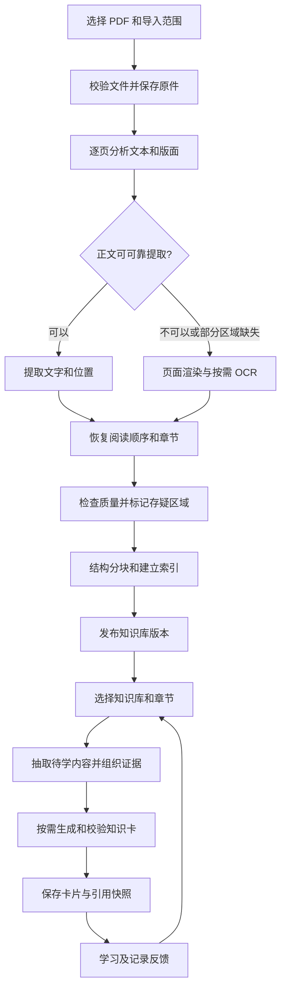

# Tell You Why：PDF 自建知识库与随机学习执行计划

计划日期：2026-09-09。状态：**设计方案，尚未实现**。本文的工期、参数与质量指标均为建议或待验收目标。

统一开发顺序与阶段依赖见 [PDF、知识库、RAG 与随机学习完整开发路线](end-to-end-development-plan.md)。本文保留 PDF 导入、OCR 和学习交互的专题设计；整体排期以统一路线为准，工期不重复累加。

目标：用户导入一本 PDF 教材后，应用在本地提取正文、按需 OCR、整理章节和来源位置，保存为可检索知识库；用户选择知识库及学习范围，生成带教材出处的知识卡，之后可以离线阅读、收藏和继续学习。

## 1. 与现有项目的衔接

现有项目采用 Tauri 2、React、Rust 和 SQLite，已有知识卡、JSON/CSV 导入、模型生成、追问、收藏和历史。已有 [RAG 执行计划](rag-implementation-plan.md)，但检索与证据链尚未实现。本方案扩展该计划的资料入口和学习方式，共用检索与引用模块。

需要明确的现状与改动：

- `GenerationRequest` 当前只有领域和数量，需要增加知识库范围、证据集合和生成约束。
- 当前 `SourceRef` 以外部 URL 为中心，需要兼容 PDF 文件版本、物理页码、书内页码标签和原文区域。
- 当前动态 AI 缓存会淘汰最近 30 张以外、没有用户交互的缓存托管卡。教材学习卡应长期保存，使用独立的归属和保留策略。
- 当前追问允许回答与卡片无关的稳定知识问题。知识库模式需要独立的检索和回答规则，不能直接复用自由追问提示词。
- 当前“已狠狠涨知识”会永久移出推荐流。教材复习应使用独立的学习状态，不能将这一行为直接解释成暂时掌握。
- 当前 JSON/CSV 导入针对小型成品卡片文件。PDF 采用独立的文件处理任务，不把整本文件读入现有卡片导入接口。

**知识库存储教材证据，知识卡存储基于证据生成的学习内容。** 原文、OCR 结果、知识点和卡片分层管理，不能只保存整本书的一份 AI 摘要。

## 2. 用户操作流程

1. 打开“我的知识库”，新建知识库或选择已有知识库，点击“导入 PDF”。第一版支持一个知识库包含多份 PDF，每次导入一个文件。
2. 应用检查格式、文件哈希、页数、加密状态和可用空间，显示文件名和导入范围。用户可选择全部页或指定页段。
3. 应用自动判断各页的文本质量；可直接读取的页面提取文本，扫描页面及识别异常区域进入 OCR。
4. 展示分阶段进度，例如“已处理 126/500 页；其中 18 页使用 OCR；3 页待检查”。支持取消、暂停和继续。
5. 导入结果展示章节目录、可用页数、失败页和识别存疑页。用户可对照原页修正文本、重新识别某页或排除某页。
6. 知识库就绪后，用户选择章节、难度及本次数量，点击“生成学习卡”。建议默认一次 10 张，允许调整。
7. 展示问题、揭晓答案、解释和“查看教材原文”；出处显示书名、章节和页码，打开原页定位对应段落。
8. 用户可收藏、标记掌握或需要复习。再次进入时恢复学习记录，随机浏览已保存的卡片；需要新内容时主动发起下一批生成。

模型和 OCR 资源安装完成后，本地解析、OCR、检索及阅读不依赖云端。生成新卡片和 AI 追问默认复用现有云端模型，需要网络及有效配置。尚未配置模型时仍能导入、搜索和阅读原文。

“导入完成”和“学习卡生成完成”是两个独立状态。导入一本教材不默认触发全书 AI 生成，也不要求等待全书所有知识点都生成完。

## 3. 内容处理流程

### 3.1 文件接收与逐页识别

- 原件复制到应用数据目录，以内容哈希识别重复文件。记录文档版本和导入页段，重复导入同一范围应返回已有结果，新增范围只补充缺页。
- 检查真实 PDF 格式、可打开性、页数和磁盘空间。加密文件提示需要密码；第一版可明确要求先导入可读取版本，不尝试绕过加密。
- 按页或按区域识别文字型、扫描型和混合型内容。判断依据包括乱码比例、文字空间分布、可见正文与文本层覆盖情况，不能只按“是否存在文字”分流。
- 文字型页面提取字符及位置；扫描页渲染为图像后 OCR。混合页保留可用文本，仅识别缺失区域，并合并重复的文本层/OCR 结果。
- 渲染分辨率、页面像素上限和并发数在技术验证后固定；初始以 1–2 个处理任务控制资源占用。

### 3.2 版面整理与质量检查

- 优先使用 PDF 书签及标题信息建立章节；缺失时结合字号、位置和编号规则推断，允许用户修正。
- 处理多栏顺序、跨页段落、页眉页脚和断行。清理规则保留原始结果及转换映射，不删除否定词、单位和适用条件。
- 同时记录 PDF 物理页序号和书内页码标签，两者可能因封面、目录而不一致。
- 每个正文块保存文档版本、页码、位置框、阅读顺序、提取方式与质量标记。引擎未提供置信度时不伪造数值。
- 表格保存表头与行列关系；公式和图表保留原页区域。第一版无法可靠解析的内容标为待检查，不能据此自动生成结论。
- OCR 分数只是识别质量信号，不是事实正确率。低质量内容可阅读、修正或重新识别，默认不作为生成证据。

### 3.3 分块与建立索引

- 优先按章节、段落、列表和表格边界切分，超长内容再按句子拆分；保留跨页映射。
- 若采用现有计划中的 BGE 候选，初始沿用约 256–384 个模型 Token 的正文块及 32–64 Token 的必要重叠；连同标题和特殊 Token 校验上限，禁止静默截断。参数在实际教材上调优。
- 原文块是可追溯的事实来源；摘要和提取出的知识点另存，不能覆盖原文。
- 先建立中文分词后的 BM25 关键词检索基线，再加入本地向量检索与排名融合。中文分词不能直接假设数据库默认分词器已满足要求。
- 所有检索先限定知识库、文档版本、章节和可用质量状态，再参与候选排序；向量检索也必须执行范围限制。
- 分别记录 OCR、分块、分词器、Embedding 模型和索引版本；内容哈希和配置不变时复用结果。

## 4. 大教材的任务与存储设计

### 4.1 可恢复的后台任务

导入状态：`queued → validating → extracting → structuring → indexing → ready`。异常状态包括 `paused`、`interrupted`、`cancelled`、`failed`、`partial_ready`，同时保存页级状态。

- 前端只订阅进度和分页结果，PDF 解析、OCR 和索引在独立工作进程执行，不能阻塞知识小窗。
- 每完成一页或一个小批次持久化检查点。某页失败不丢失之前结果，只重试失败页；自动重试次数和总耗时有上限。
- 暂停时完成当前安全检查点；工作进程卡住时可终止并重做当前单元。应用重启后显示可继续任务，由用户恢复。
- 文件流式复制、图像逐页生成并释放，预览图使用有上限的缓存，避免一次将整本教材的图像放入内存。
- 区分“扫描完成”和“可用内容覆盖率”；部分失败必须显示失败范围。第一版允许以明确的 `partial_ready` 状态发布可用页；继续处理后发布新版本。
- 重试键包含文档版本、页码/区域、处理配置和阶段；结果幂等入库，不能重复增加页、片段或知识卡。
- 先构建临时版本，完整校验后发布版本指针。旧引用固定指向生成时使用的内容，不随重建漂移。

性能验证覆盖约 100、500、1000 页的教材，以及扫描、多栏和混合 PDF；文件大小边界在验证后设定。正式承诺支持范围前记录测试机器、峰值内存、临时磁盘占用、冷启动和处理耗时，不预先承诺“几秒读完一本书”。

### 4.2 数据归属

继续使用本地存储。Rust 管理业务 SQLite；工作进程管理独立的知识库数据与索引，避免两个模块共同写用户业务表。

| 数据 | 建议存放位置和主要内容 |
| --- | --- |
| 知识库登记 | 业务 SQLite：名称、知识库 ID、活动版本、就绪状态、学习范围 |
| 导入任务 | 业务 SQLite：任务状态、汇总进度；工作区保存页级检查点，由任务 ID 关联 |
| 原始 PDF | 应用数据目录：不可变文件版本、内容哈希、书名和导入信息 |
| 页面与正文块 | 知识库 SQLite：页码、章节、位置、原始与清理后的文本、质量与版本 |
| 片段与检索索引 | 知识库目录：chunk ID、原文映射、关键词索引、向量及配置版本 |
| 知识点 | 业务 SQLite：概念 ID、学习目标、知识库归属、证据片段、生成与审核状态 |
| 学习卡与引用 | 现有卡表及新增关联表：知识库归属、知识点、证据快照和精确定位 |
| 学习记录 | 新增学习状态表：已读、掌握、需复习、最近展示时间；复用收藏和历史 |

一次卡片入库事务同时保存卡片、出处快照和知识库归属。不能依赖跨两个 SQLite 文件的隐含事务：知识库版本先落盘校验，再由业务库事务发布指针，启动时清理或恢复未完成发布。

同一知识点可以有多种问法，去重范围包含知识库身份和知识点；不能只依赖当前全局题面相似度或全局唯一指纹，否则相同题目在不同知识库间可能互相吞掉来源。需要兼容旧卡片的数据迁移。

删除知识库时展示其关联卡片和资料的处理范围。建议提供“删除资料并保留卡片及引用摘录”和“全部删除”两种明确选项；保留卡片时说明无法再打开已删除的原页。删除、重建与生成并发时使用任务版本检查和现有持久化保护，防止已删资料被迟到任务重新写回。

## 5. 随机学习和基于教材生成

### 5.1 抽取策略

随机学习由应用选择素材，模型负责把选定素材组织成学习卡。

1. 固定用户选中的知识库、文档版本、章节和难度。
2. 在有可用证据的章节中平衡抽样，避免长章节因片段多而长期占据推荐。
3. 优先选择未覆盖的正文单元，提取或复用其中的知识点；知识点目录逐步补齐，不在导入时强制生成全书目录。
4. 排除本批重复、最近展示以及用户不希望再推荐的知识点。候选不足时明确说明，允许用户切换到复习模式。
5. 对选中的知识点补充邻近段落和检索得到的定义、条件或例子，形成受长度约束的证据包。
6. 生成、校验并持久化本批卡片，随后随机展示。

知识点 ID、来源块重叠和题面相似度共同用于第一版去重，后续再加入语义去重。随机过程在测试中可固定种子；“生成覆盖率”与“用户掌握率”分别显示，不能将抽查过部分教材说成掌握全书。

第一版完成“未学优先、章节均衡、近期避重、手动复习”；下一版再加入到期复习调度和更细的难度适配。

### 5.2 生成和引用校验

- Rust 向现有模型适配器提供任务、允许的证据 ID、原文及限制；模型返回问题、简短答案、解释和引用 ID。
- 书名、页码、章节和原文位置由程序填充，不能由模型自由编写。
- 检查输出结构、引用 ID 是否属于本次证据集合、定位和版本是否有效；进一步检查核心结论是否有证据支持。
- 自动支持性判断不能保证事实正确，需要人工标注的样例校准。标记为“基于教材生成，未经人工核验”，不自动升级为“已核验”。
- 资料只支持 3 张卡时，即使用户请求 10 张，也返回 3 张及不足原因；不通过编造细节补足数量，也不为满足解释字数而强行扩写。
- 出错允许保留已成功卡片。所有内部重试、跨供应商切换计入同一次任务预算，处理成功但返回丢失时通过请求 ID 去重。
- 知识库卡片不纳入现有 30 张动态缓存淘汰策略；本地随机浏览已存卡片不触发模型请求。

### 5.3 追问

追问先结合当前卡片解析问题，再在同一知识库范围内检索新的证据。历史 AI 回复只用于理解对话，不视为教材事实来源。

资料不足时说明缺少依据。用户主动选择普通 AI 追问时，才进入已有的开放问答流程，并清楚区分回答依据。不能因检索失败静默切换为无资料生成。

## 6. 推荐技术架构

| 层级 | 推荐实现 | 选择理由 |
| --- | --- | --- |
| 用户界面 | 沿用 React/Tauri | 新增知识库、导入任务、章节选择和原文查看页面 |
| 业务调度 | 沿用 Rust | 管理任务、业务数据库、模型请求、凭据及预算 |
| PDF 处理 | Python 工作进程中的 PDFium / pypdfium2 | 统一承担 PDF 文本提取、页面渲染和位置读取，先验证所需定位能力 |
| OCR 与版面 | PaddleOCR；复杂版面评估 PP-StructureV3 | 按需启用文字、版面、表格等模块，以本机实测确定配置 |
| 检索 | 中文分词 BM25，随后加入本地 BGE 小模型与融合检索 | 先建立可评测基线，再衡量语义检索收益 |
| 模型生成 | 复用 DeepSeek/Kimi 适配器 | 增加有证据模式，不把 OCR 依赖绑定到生成供应商 |
| 存储 | 本地 SQLite、原始 PDF、版本化索引文件 | 复用现有持久化方式，方便离线阅读和增量重建 |

PDFium 的 Python 封装提供文本提取、渲染和目录等接口；实际抽取顺序和坐标完整性仍需样本验证。[pypdfium2 官方文档](https://pypdfium2.readthedocs.io/en/stable/)

PP-StructureV3 提供版面、文字、表格、公式及阅读顺序等处理能力，但不代表任意教材都能准确识别。第一版优先普通中英文印刷正文，复杂公式、图表和手写内容作为有质量门槛的扩展。[PaddleOCR 官方文档](https://paddlepaddle.github.io/PaddleOCR/main/en/version3.x/pipeline_usage/PP-StructureV3.html)

本地中文 Embedding 沿用现有计划中的 `BAAI/bge-small-zh-v1.5` 候选；锁定模型 revision，遵守查询指令与文档编码配置，英文占比高时另行评测适合的模型。[BGE 模型卡](https://huggingface.co/BAAI/bge-small-zh-v1.5)

开发先验证 CLI，再打包成由 Rust 管理的 sidecar 工作进程。**本方案将旧 RAG 计划中的 FastAPI 桌面连接方式调整为进程管道通信**，统一复用解析与检索工作进程；CLI 保留用于测试。使用结构化请求、任务 ID、进度事件及产物清单，避免为本地功能增加常驻 HTTP 端口。Tauri 支持随包分发外部程序，但 Python、OCR、模型依赖的完整 Windows 打包仍须单独验证。[Tauri sidecar 文档](https://v2.tauri.app/develop/sidecar/)

安装包不要求用户自行安装 Python。OCR 和向量模型可作为应用管理的资源包，明确下载大小、版本和校验值，下载可恢复；加载失败时给出可操作的错误。首阶段即验证无开发环境、普通 CPU、中文路径下能否运行，并核对实际分发的依赖及模型许可。

原文及 OCR 默认在本地处理。生成按钮说明将发送选定教材片段及费用可能性；供应商切换仅限用户允许接收这些资料的通道。PDF 正文按不可信资料处理，不能执行其中的指令或让它改变文件访问、模型设置和数据发送范围。

## 7. 代码改动清单

以下目录和接口为建议名称，尚未创建。

| 位置 | 改动 |
| --- | --- |
| 新增 `rag-service/` | PDF 解析、OCR、章节、分块、索引、检索、CLI 和工作进程协议 |
| 新增 `src-tauri/src/knowledge_base.rs` | 知识库登记、活动版本和生命周期 |
| 新增 `src-tauri/src/import_jobs.rs` | 导入状态、检查点协调、工作进程管理和进度事件 |
| `src-tauri/src/commands.rs` | 导入/暂停/继续、知识库查询、指定知识库生成及追问 |
| `src-tauri/src/db.rs` | 知识库归属、证据快照、学习状态、去重与缓存保留规则迁移 |
| `src-tauri/src/providers/mod.rs` | 带证据的生成和追问结构、部分完成及预算 |
| `src-tauri/src/models.rs`、`src/types.ts` | 文件来源、知识库、任务、证据、学习状态类型 |
| `src-tauri/src/content.rs` | 教材生成结果的结构与引用校验 |
| `src/lib/api.ts` | 新命令和进度事件封装，兼容浏览器演示模式 |
| 新增前端页面/组件 | 知识库列表、导入向导、任务进度、章节选择、原页对照 |
| `KnowledgeHome`、`KnowledgeCardView` | 学习来源切换、教材引用、知识库内追问和学习反馈 |
| Tauri 打包与资源配置 | 工作进程、模型资源、安装和升级验收 |

建议命令：`inspect_pdf`、`start_pdf_import`、`pause_import`、`resume_import`、`cancel_import`、`list_knowledge_bases`、`get_knowledge_base`、`generate_library_cards`、`get_pdf_evidence`。任务开始后立即返回任务 ID，进度通过事件及状态查询获取。

## 8. 执行顺序与交付物

估算前提：一名熟悉现有项目的开发者、Windows 桌面优先、普通中英文印刷教材、复用现有模型通道；包含基础检索与引用开发。以下为总方案估算，不应再与旧 RAG 计划的工期重复相加。

| 阶段 | 主要工作 | 可验收交付物 | 粗估开发日 |
| --- | --- | --- | --- |
| 0：技术验证 | 准备文字、扫描、混合、多栏和长教材样本；验证 PDF 定位、OCR CPU 推理、工作进程打包 | 质量/性能基线、安装冒烟结果、依赖版本和第一版支持边界 | 2–3 |
| 1：知识库与任务基础 | 数据迁移、文件保存、知识库界面、任务状态、检查点、旧数据兼容 | 文件导入可追踪，重启后能继续任务 | 2–3 |
| 2：解析和 OCR | 逐页分流、版面整理、质量标记、原文预览及单页重试 | 扫描教材可变成有页码、有质量状态的结构化正文 | 4–6 |
| 3：分块与检索 | 来源映射、关键词基线、本地向量和融合、范围过滤 | 能从选定知识库检索正确证据；索引可增量重建 | 3–4 |
| 4：学习闭环 | 抽样、知识点、带引用生成、持久保存、追问、学习状态 | 选择教材生成一批可溯源卡片，重启及离线阅读正常 | 3–5 |
| 5：整体交付 | 质量评测、长文件压力测试、取消恢复、删除并发、安装升级回归 | 评测报告、已知限制和可安装的 Windows 版本 | 3–4 |

**第一版粗估 17–25 个开发日，约 4–5 个工作周；阶段 0 后重新校准。** 无需独显是验证目标，不能在实测前视为已满足。公式/图表高保真解析、间隔复习、跨书综合出题和高级语义去重另排后续迭代。

实施顺序先完成“文字 PDF → 原文定位 → 一张有引用卡片”的最短链路，再扩展扫描、多栏、长文件和完整交互；OCR 与打包可行性在阶段 0 提前验证。

## 9. 验收标准

| 维度 | 第一版验收目标 |
| --- | --- |
| 页面完整性 | 每个选中页面都有成功、排除或失败状态；部分成功不可显示为全书成功 |
| OCR 质量 | 在人工转录的代表性普通印刷正文样本上，以字符错误率 CER ≤ 5% 为初始目标；按语言/版面分组报告，数字、单位和否定词单独核查，复杂块另评 |
| 来源定位 | 所有入库引用均能定位到生成时的文档版本和原文；书内页码与 PDF 页码不混淆 |
| 检索 | 准备至少 50 个有标注证据的检索/生成/不足资料任务并划分开发与保留集；可回答任务 Hit@5 初始目标 ≥ 90%，多证据任务另测覆盖率 |
| 生成依据 | 人工抽查关键结论支持率初始目标 ≥ 90%；程序拒绝未知引用 ID，资料不足不强凑数量 |
| 随机学习 | 只从选定知识库和章节出题，批内知识点不重复；排除和冷却规则可确定性测试，章节抽样分布与设计一致 |
| 长教材 | 约 100/500/1000 页样本记录耗时、峰值内存和磁盘；学习界面持续可操作，处理队列和图像缓存有界 |
| 恢复与幂等 | OCR 失败、进程退出和应用重启后仅补做未完成单元；重复导入和重试不产生重复记录 |
| 数据保留 | 教材卡片不被动态缓存规则淘汰；收藏、引用、学习状态和追问重启后保留 |
| 删除与更新 | 删除期间迟到任务不能写回；重新 OCR/分块后旧卡引用仍准确，或明确标记旧版本来源不可用 |
| 安装运行 | 在无 Python/开发工具的目标 Windows 环境验证安装、首次资源准备、中文路径、离线重启及升级 |
| 现有功能 | 旧卡片、JSON/CSV 导入、模型切换、收藏、历史和清空数据流程回归通过 |

质量指标均为待测目标，报告需附样本数、分组、引擎/模型版本和失败案例。OCR 准确、检索命中与答案有据分别评估，不能相互替代；模型自动评分需人工抽查。

功能测试使用固定 PDF 夹具和模型 Mock；真实 OCR 与模型样例用于质量评测。保留现有前端及 Rust 检查，并增加必要的迁移、任务恢复、范围隔离和引用一致性测试。

第一批实际开发交付物应是：样本集与技术验证报告、知识库数据结构草案、可恢复导入任务骨架，以及文字 PDF 的逐页提取和原文定位原型。
