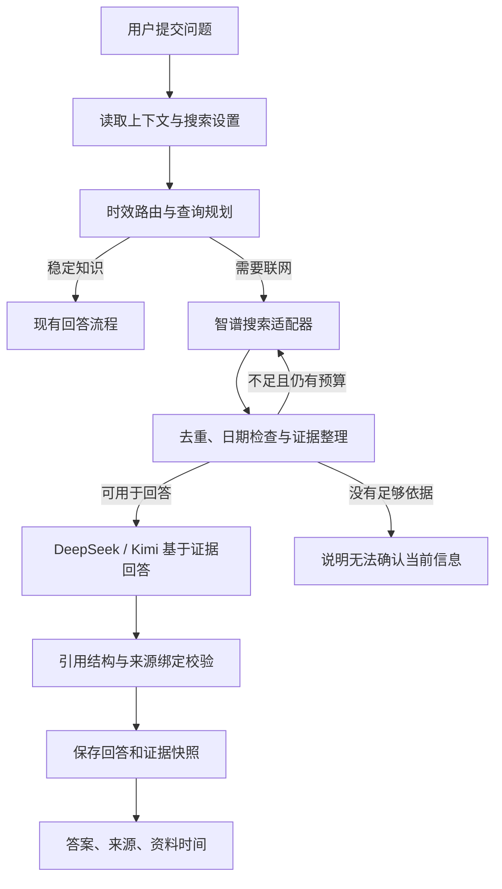

# 智谱搜索 Agent 设计方案

日期：2026-09-21。本文件保留初始设计；后续用户已授权实施 P0–P2，实际范围与阶段结果见[验证记录](validation/search-agent-p0-setup.md)。

配套文档：[开发计划](search-agent-development-plan.md)。

## 1. 设计结论

在 Rust 核心增加一个受预算约束的搜索 Agent，使用智谱 Web Search API 获取网络证据，由当前选定的 DeepSeek / Kimi 完成回答。Agent 负责判断是否需要搜索、组织查询、必要时补搜、整理证据，以及控制超时、引用和失败行为。

搜索能力与回答模型分别配置。这允许用户继续使用现有模型，搜索也可以被卡片追问、陪伴学习和后续教材拓展共同调用。首版采用应用内编排和直接 HTTPS 请求，复用现有 Rust 依赖，无需额外 Python 服务、MCP 服务或 Agent 框架。

目标是让时效性回答有可追溯依据，能说明资料的时间和不足。联网本身不能保证结果正确；网页索引也不能保证秒级行情、天气观测等实时数据的完整性。首版重点支持近期技术进展、版本变化、公开发布信息和可由网页查证的当前事实。

## 2. 当前代码与接入约束

| 当前能力       | 已核实的代码事实                                                                   | 设计影响                                                            |
| -------------- | ---------------------------------------------------------------------------------- | ------------------------------------------------------------------- |
| 桌面架构       | React / TypeScript → Tauri / Rust → 在线模型，SQLite 本地存储                      | 搜索请求、凭据和证据持久化放在 Rust                                 |
| 模型调用       | `src-tauri/src/providers/mod.rs` 管理 DeepSeek / Kimi，HTTP 主机白名单尚不包含智谱 | 建立独立 SearchProvider 接口，调整受限 HTTP 目标策略                |
| 卡片追问       | `commands.rs::ask_follow_up_inner` 构造上下文并调用模型，支持供应商回退            | 在模型选择循环外完成一次检索；切换回答模型时复用证据                |
| 陪伴学习       | `study_agent.rs` 只有本地卡片检索；待回答问题强制只允许 `answer_question`          | 在最终回答前增加异步搜索阶段；仅添加工具定义不会生效                |
| Agent 控制     | `harness/policy.rs` 已提供时间、Token、调用次数预算；部分接口依赖复习领域          | 复用可复用的控制逻辑，新增搜索策略；避免直接照搬复习工具执行器      |
| 教材证据       | `rag.rs::validate_draft` 校验引用 ID、引文是否属于证据包                           | 借鉴并按网页摘要特点适配，保留 PDF 页码引用的独立语义               |
| 来源与可信状态 | `models.rs` 已有 `SourceRef`、`SourceGrounded`；追问结果主要是文本                 | 需要扩展回答、历史、学习收获的数据结构；联网不能自动标为 `Verified` |
| 密钥           | `secret_store.rs` 使用 Windows Credential Manager                                  | 智谱使用独立凭据引用，完整 Key 不进入 SQLite 或日志                 |
| 内容生成       | 当前生成提示明确限制稳定知识，禁止需要实时数据的问题                               | 实时卡片须单独增加生成模式、证据与过期逻辑，不能只删提示限制        |

现有教材学习卡还有独立的 `learning_generation.rs` 路径。后续覆盖所有输出时，应逐条接入，不能假设修改一个模型方法就覆盖全部功能。

## 3. 智谱接入方案选择

智谱官方指南区分独立 Web Search API、在 GLM 对话中联网，以及托管 Search Agent；独立搜索返回结构化网页资料，支持查询范围等设置。[官方联网搜索指南](https://docs.bigmodel.cn/cn/guide/tools/web-search)

| 方案                                   | 对当前 APP 的影响                                      | 建议                      |
| -------------------------------------- | ------------------------------------------------------ | ------------------------- |
| 智谱 Web Search API + 应用内搜索 Agent | 应用持有原始搜索证据、预算和记录，继续使用现有回答模型 | 首版采用                  |
| GLM 对话内置搜索                       | 联网与回答绑定 GLM，需新增完整生成模型适配             | 用户需要 GLM 回答时再扩展 |
| 智谱托管 Search Agent                  | 需适配其会话、运行状态和引用协议，并核实取消与计费边界 | 复杂调研阶段单独评估      |

这里的“搜索 Agent”指 APP 内的编排模块，搜索供应商为智谱；不等同于直接接入智谱的托管 Search Agent 产品。

拟接入中国区 `POST https://open.bigmodel.cn/api/paas/v4/web_search`。以官方指南展示的 `search_pro` 为首个验证候选；`search_query`、结果数、时间范围、域名过滤和摘要长度由适配器映射。**端点、鉴权、可用引擎枚举、参数边界和错误结构必须在 P0 用当前接口文档及真实账号确认，再冻结实现。**

研究边界：本次读到了官方概览和调用示例，但接口详情页抓取失败，价格页只返回需 JavaScript 的页面。尚未使用用户 API Key 发起真实搜索，因此本方案不声称账号可用，不承诺单价、配额或延迟。[官方接口详情入口](https://docs.bigmodel.cn/api-reference/工具-api/网络搜索)、[官方价格页](https://bigmodel.cn/pricing)

## 4. 功能范围与分期

| 功能入口                       | 第一阶段 MVP                       | 后续阶段                                   |
| ------------------------------ | ---------------------------------- | ------------------------------------------ |
| 普通知识卡追问、划词提问       | 时效问题先搜索，显示引用与检索时间 | 更复杂的多来源比较                         |
| 陪伴学习自由提问、疑问再次解释 | 回答前搜索，保持当前步骤，保存证据 | 学习计划和讲解步骤也可按需检索             |
| 普通知识卡生成                 | 延续稳定知识模式                   | 增加显式“近期知识”模式，保存时间范围和证据 |
| 教材问答与教材学习卡           | 延续教材证据范围                   | 用户开启“联网拓展”后展示外部资料，独立标识 |
| 教材复习与练习评分             | 沿用教材和既有练习依据             | 可提供补充阅读，不用网页自动改写历史评分   |

MVP 是第一批交付，后续阶段用于完成其余输出路径的覆盖。首版不包含自动新闻推送、后台定时搜索、网页爬虫、任意网址抓取或长篇调研报告。

## 5. 执行架构

Search Agent 输出统一的 `EvidencePacket`，由各功能的回答适配层使用。每条路径共享搜索策略，但保留自己的正文形式、持久化方式和业务校验。

建议状态：`planning → searching → preparing_evidence → answering → validating → completed`；可终止为 `insufficient`、`failed`、`cancelled`。部分问题可回答时使用 `partial`，逐项列出尚不能确认的部分。

### 5.1 搜索路由

提供三种模式：`off`（关闭）、`auto`（自动）、`always`（每次联网核查）。升级默认关闭；用户配置智谱并开启后默认 `auto`。每次问题可选择“本次联网”，该操作适用当前问题。

| 问题类型                                         | 行为                                                     |
| ------------------------------------------------ | -------------------------------------------------------- |
| 用户明确要求搜索、查证、最新信息                 | 开启权限后必须进入检索流程                               |
| 今天、近期、今年、最新版本等显式时间线索         | 搜索；把相对时间转换成具体日期范围                       |
| “这个库还维护吗”“现在推荐哪个版本”等隐含时效问题 | 使用主题规则和至多一次模型规划辅助判断；不能只匹配关键词 |
| 稳定原理、数学解释、历史定义                     | 自动模式通常不搜索                                       |
| 概念与最新事实混合                               | 稳定原理与当前事实分开组织，当前事实必须有证据           |
| 地区、产品或时间范围不明确，影响结果             | 在 APP 内澄清，或明确采用的合理范围                      |
| 搜索关闭、未配置或失败                           | 可以讲稳定背景，但不生成未经确认的当前结论               |

路由输入带 `now`、用户时区、入口和必要的短对话上下文。默认读取系统时区，不把“中国区 API”误当成用户时区。保存实际采用的时间范围，以便之后追问“刚才那个版本”时正确关联。

不要把完整历史、练习记录或 PDF 原文当成搜索词。先解析指代，再生成必要的实体、主题和日期；旧助手回答不作为当前事实证据。

### 5.2 搜索、补搜与停止

建议首版策略，均为待真实验证的产品参数：

- 通常一次查询；第一批为空、主题不符、日期不满足或出现明显冲突时，最多再查询一次。
- 每个回答最多 2 次实际搜索 HTTP 尝试，重试、改写查询和引擎回退共同消耗此上限；不能各自拥有额外的隐藏次数。
- 模型调用总上限建议 3 次，包含可选规划、正文生成、一次结构修复及供应商回退的实际尝试；超限停止。
- 搜索单次超时建议 10 秒，搜索阶段总预算 20 秒；整体主动执行预算建议 90 秒，并与父学习会话取更严格的剩余额度。
- 请求结果数初设 5，最终证据上限 8 条；按 Token 预算和字符硬上限双重裁剪。具体参数是否有效在 P0 核实。
- 官方来源优先；重大或存在争议的结论尽量交叉核对。不同网站转载同一通稿不能算独立证据，一份权威原始公告也不必机械凑两份来源。
- 窄时间范围无结果时，可以扩大窗口，但必须重新检查证据日期；扩大检索范围不能改变用户提出的事实时间要求。

MVP 不自动下载搜索结果网页，证据来自 API 返回的摘要或内容。信息太短、发布日期缺失或不能覆盖关键问题时，降低结论范围或返回不足；不能声称已经完整阅读并核实原网页。

### 5.3 证据与引用

每条网页证据由 Rust 分配本次运行内唯一 ID（如 W1）。模型只输出事实段落、对应证据 ID 和必要的短引文；URL、标题、发布方和日期从证据快照取得。

证据处理包括：限制响应大小；清除不适用的控制字符与页面标记；检查 URL；规范化并去重；保留原始资料日期；按相关性、时效性和来源质量选择。去重不要误删影响页面身份的路径或查询参数。

回答校验分两层：

1. 程序强制检查来源 ID 属于当前证据包、引用不越界、引文属于保存的摘要、链接来自供应商结果，以及当前事实段落是否提供引用。
2. “证据是否真的支持这个结论”属于语义质量问题，不能靠 ID 校验证明。用生成约束、必要的复核及人工评测检查；冲突或证据不足时明确说明。

带引用不自动等于正确。沿用 `SourceGrounded` 表达有来源依据；`Verified` 继续保留原有核验语义。对原卡的联网追问不会自动提高原卡可信等级，也不会覆盖原卡内容。

### 5.4 时间语义

分别记录 `retrieved_at`（本次获取时间）、`published_at`（资料发布日期，允许空）、`as_of`（回答采用的事实时间）、`expires_at`（本应用建议重新检索时间）。检索时间不能填到发布日期字段。

API 的时间过滤只是检索条件，不能代替结果级检查。旧闻重发、未来日期、无日期网页和“最新但没有日期”的摘要都纳入异常场景。技术版本事实优先依据发布公告、版本记录等原始来源。

旧回答重新打开时展示“当时检索于……”；缓存过期后不能自动当成最新依据。“重新核查”产生新回答版本，保留旧版供回看。

## 6. 接口和数据设计

以下为拟定契约，不是本次实现代码。

| 对象             | 主要字段                                                                                         |
| ---------------- | ------------------------------------------------------------------------------------------------ |
| `SearchSettings` | provider、engine、mode、keyConfigured、keyLast4、dailyAttemptLimit、policyVersion                |
| `SearchRequest`  | runId、question、contextSummary、now、timezone、mode、sourceScope                                |
| `SearchPlan`     | needsSearch、reasonCode、query、dateRange、domainPreference、freshnessClass                      |
| `WebEvidence`    | id、runId、title、url、publisher、snippet、publishedAt?、retrievedAt、providerRefer?             |
| `EvidencePacket` | runId、query、asOf、expiresAt?、status、evidence、gaps、policyVersion                            |
| `GroundedAnswer` | status、blocks（text + evidenceIds）、sourceSnapshotId、asOf、limitations                        |
| `SearchRun`      | entryPoint、parentSessionId?、requestId、state、attemptCount、latency、errorCode、configSnapshot |

生成模型不得提供或修改来源元数据。旧回答保留文本兼容字段；新前端通过结构化 blocks 展示引用，不使用模型生成的任意 Markdown URL 作为证据链接。

建议新增存储：

- `search_profiles`：搜索模式、引擎、凭据引用与配置版本，不含完整 Key。
- `search_runs`：请求状态、查询、时间范围、尝试次数、简化追踪和父任务关联。
- `web_evidence_snapshots`：回答实际使用的证据快照，可按 run 保存有上限的 JSON。
- `search_cache`：可过期的检索缓存，与永久回答证据分开。
- 追问结果和学习回答关联快照 ID；学习收获、疑问再次解释保留相应来源，不只复制正文。

SQLite 采用新增表和可选字段迁移。当前主迁移到 v13，落地时以实际分支的下一个版本为准。旧会话缺字段时默认无搜索记录；不能为旧答案补造来源。

建议 Tauri 命令：读取/保存搜索配置、删除搜索 Key、测试搜索连接、取消搜索运行、按已有问题重新核查。查询命令只接受受限参数；前端不能提交任意 API 地址，也不能直接读取 Key。取消和重试都通过 runId 校验归属。

## 7. 界面设计

在“模型设置”增加“联网搜索”区，与在线生成模型、PDF 本地模型并列。提供智谱 Key、连接测试、模式和每日请求上限；引擎高级选项只展示已验证可用的配置。保存凭据后清空输入，仅显示掩码与配置状态。

测试连接使用固定公开查询，明确它会发起一次真实搜索并计入应用请求次数。Key 保存成功与接口验证成功是两个状态。

回答区域采用适合 360–420 像素宽度的布局：

- 输入旁有搜索模式指示和“本次联网”操作。
- 等待时展示“正在查找资料”“正在整理回答”，支持取消。
- 正文当前事实附编号引用；底部显示“联网资料 · 检索于……”。
- 点击编号展开来源卡片：标题、网站、资料日期（未知时如实显示）、打开原文。
- 错误给出对应操作：配置 Key、稍后重试、调整问题或仅查看稳定背景。

搜索过程不挤入全文聊天记录。技术错误码和详细耗时放在现有开发者工具中；日常界面只展示用户能采取行动的信息。后台返回的旧 runId 不能覆盖新问题或已取消状态。

## 8. 凭据、权限和失败处理

智谱请求只从 Rust 发出，使用独立凭据引用（拟为 `zhipu-search:cn`）和固定官方 HTTPS 目标，禁用自动重定向。可以共享 HTTP 传输基础设施，但搜索适配器不能拿到 DeepSeek / Kimi 的 Key。搜索目标与可打开的来源 URL 分开校验。

首次开启的设置文案说明：必要查询会发送到智谱，选中的搜索资料会发送到当前回答模型。PDF 联网拓展后续单独提供范围选择，避免把原文默认为搜索输入。搜索资料按不可信数据处理，其中指令不能改变工具权限、读取凭据或引发文件操作。

| 情况                                  | 处理                                                     |
| ------------------------------------- | -------------------------------------------------------- |
| 缺少 / 无效 Key、账号无权限、余额不足 | 提示设置或账号问题，不自动重试                           |
| 429、网络或服务暂时故障               | 仅在剩余预算内考虑一次重试；遵守供应商重试提示           |
| 请求发出后超时                        | 标记尝试结果不确定；可能已计费，不能当作零调用           |
| 空结果、结果过旧或证据矛盾            | 最多补搜一次；仍不足则说明不能确认                       |
| 回答模型失败                          | 复用当前证据，按现有模型回退策略和总预算处理             |
| 引用结构错误                          | 最多一次受预算约束的修复，仍失败则不展示伪引用答案       |
| 取消、暂停、退出后迟到结果            | 禁止继续生成或覆盖业务状态；已发出的供应商请求可能仍计费 |
| 无法确认的秒级事实                    | 说明当前网页证据的时间和限制，不把历史数据包装成实时值   |

权限关闭、删除 Key 和“全部清除”应阻止后续请求，清理搜索数据并使未完成结果失效。浏览历史清除、卡片删除、学习收获保留等操作应继承现有数据语义，明确证据引用的保留与删除规则。

## 9. 缓存、预算与恢复

缓存键包含规范化查询、引擎、时间范围、域名限制、摘要规格和策略版本。用户明确“现在重新查”时绕过缓存。建议新闻缓存 5–15 分钟、版本资料缓存数小时；均为初始策略，按评测调整。严格即时查询不复用过期缓存。

持久化的回答证据不会随短期缓存淘汰而消失。默认仅保存必要摘要；未被回答引用的搜索追踪可按期限清理，用户可清除搜索缓存和记录。

搜索次数独立于现有每日“成功生成卡片数”。建议默认每天 50 次搜索尝试，可配置；HTTP 发出前原子预留，测试连接、重试和补搜也计数。未知计费结果保守记为已尝试，供应商实际账单才是费用依据。

单轮预计费用 = 搜索实际尝试次数 × 已核实搜索单价 + 所有规划/回答/修复模型的 Token 费用。未确认价格时只显示次数，不展示虚假精确金额。

保存配置与证据快照，支持进程重启后显示已完成结果。对未完成外部请求不承诺“恰好一次”，除非 P0 确认供应商幂等协议；未确认结果的请求不自动重放。用户明确恢复时检查剩余预算、当前权限和证据是否过期。修改学习提示版本时应提供旧会话兼容路径，避免直接使已有会话失效。

## 10. 验收目标

验收覆盖路由正确性、时间适用性、引用语义、取消恢复及费用边界。测试样例、人工评测口径与分阶段退出条件见[开发计划](search-agent-development-plan.md)。成功标准是能确认的当前事实有依据、不能确认时如实说明，同时保持稳定知识回答和既有学习流程可用。
